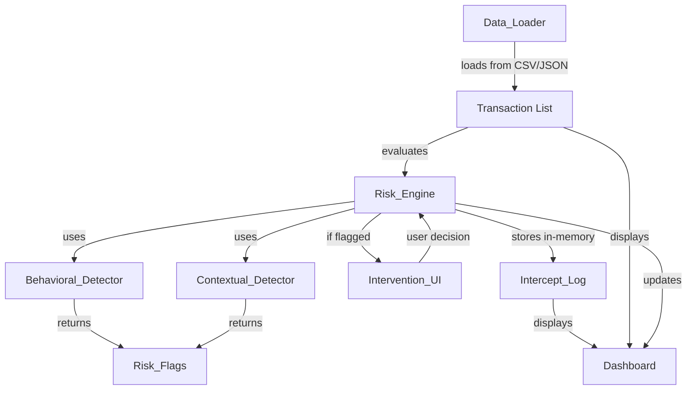

# Design Document: Transaction Intervention System

## Overview

SpendSense is a real-time financial transaction monitoring and intervention system built as a hackathon demo. The system loads transactions from a sample dataset (CSV/JSON), analyzes them through a dual-check risk engine (behavioral + contextual detection), and intervenes with explainable alerts before potentially regrettable purchases are completed.

The system architecture prioritizes simplicity and demo-readiness over production scalability. All components run in a single Python process with Streamlit providing the UI layer. All data is stored in-memory using Python lists and dictionaries for fast access during the demo session. The design emphasizes transparency through risk explanations, future impact projections (compound interest calculations), and comprehensive dashboards for tracking spending patterns and intervention outcomes.

Key design principles:
- Sample data loading: Transactions loaded from CSV/JSON file for consistent demo scenarios
- In-memory processing: All data stored in Python data structures (no database)
- Real-time processing: Transactions are evaluated immediately as they're loaded
- Explainability: Every risk flag includes human-readable explanations and future impact projections
- Dual-check risk detection: Behavioral patterns (budget drain, late-night spending) + contextual anomalies (new recipients, frequency bursts, device/location changes)
- User agency: 10-second cooling-off period with option to proceed or cancel
- Session-based: Data persists only during the active demo session

## Architecture

### System Components

The system consists of four primary components:

1. **Data_Loader**: Loads transactions from CSV/JSON sample dataset into memory
2. **Risk_Engine**: Orchestrates risk detection and decision recording
   - **Behavioral_Detector**: Analyzes spending patterns and timing
   - **Contextual_Detector**: Analyzes transaction context and anomalies
3. **Intervention_UI**: Displays risk alerts with countdown and decision buttons
4. **Dashboard**: Visualizes transaction history, patterns, and metrics

All data is stored in-memory using Python data structures (lists and dictionaries) for the duration of the demo session.

### Component Interactions



### Data Flow

1. Data_Loader reads transactions from CSV/JSON file and loads them into memory
2. Risk_Engine receives each transaction and invokes both detectors
3. Behavioral_Detector checks for budget drain and late-night patterns
4. Contextual_Detector checks for new recipients, frequency bursts, and device/location anomalies
5. If any detector flags the transaction:
   - Intervention_UI displays risk explanations and future impact projections
   - 10-second countdown begins
   - User chooses to cancel or proceed
6. Risk_Engine records the transaction and decision to in-memory Intercept_Log
7. Dashboard updates in real-time with new transaction and metrics

### Technology Stack

- **Language**: Python 3.9+
- **UI Framework**: Streamlit (for rapid prototyping and demo)
- **Data Processing**: pandas (for CSV/JSON loading and transaction manipulation)
- **Data Storage**: In-memory Python lists and dictionaries
- **Visualization**: Plotly (interactive charts for dashboard)
- **Testing**: pytest + Hypothesis (for property-based testing)

## Components and Interfaces

### Data_Loader

**Purpose**: Load transactions from CSV/JSON sample dataset into memory

**Interface**:
```python
class DataLoader:
    def load_from_csv(self, file_path: str) -> List[Transaction]:
        """Load transactions from CSV file"""
        pass
    
    def load_from_json(self, file_path: str) -> List[Transaction]:
        """Load transactions from JSON file"""
        pass
    
    def validate_transaction(self, transaction_data: Dict) -> bool:
        """Validate that transaction has all required fields"""
        pass
```

**Behavior**:
- Reads CSV or JSON files containing transaction data
- Validates that all required fields are present (txn_id, user_id, timestamp, amount, category, recipient_status, monthly_budget_remaining, device_id, location, channel)
- Skips invalid records and logs warnings
- Returns list of Transaction objects for in-memory processing
- Supports pandas for efficient CSV/JSON parsing

### Risk_Engine

**Purpose**: Orchestrate risk detection and record decisions in-memory

**Interface**:
```python
class RiskEngine:
    def __init__(
        self,
        behavioral_detector: BehavioralDetector,
        contextual_detector: ContextualDetector
    ):
        self.transactions: List[Transaction] = []
        self.intercept_log: List[InterceptLog] = []
        self.money_saved: float = 0.0
    
    def evaluate_transaction(self, transaction: Transaction) -> RiskAssessment:
        """Evaluate transaction through both detectors"""
        pass
    
    def record_decision(
        self,
        transaction: Transaction,
        risk_assessment: RiskAssessment,
        user_decision: str  # "cancelled" or "proceeded"
    ) -> None:
        """Record transaction and decision to in-memory storage"""
        pass
    
    def get_recent_transactions(
        self,
        user_id: str,
        time_window_minutes: int
    ) -> List[Transaction]:
        """Retrieve recent transactions from in-memory list"""
        pass
    
    def get_all_transactions(self) -> List[Transaction]:
        """Retrieve all transactions from memory"""
        pass
    
    def get_intercept_log(self) -> List[InterceptLog]:
        """Retrieve all flagged transactions from memory"""
        pass
    
    def get_money_saved(self) -> float:
        """Return total money saved from cancelled transactions"""
        pass
```

**Behavior**:
- Invokes both Behavioral_Detector and Contextual_Detector
- Aggregates risk flags from both detectors
- Stores all transactions in in-memory list (flagged or not)
- Updates money_saved counter when transactions are cancelled
- Maintains transaction history in memory for contextual detection
- Stores intercept log in memory for dashboard display

### Behavioral_Detector

**Purpose**: Detect risky spending patterns and timing

**Interface**:
```python
class BehavioralDetector:
    def detect(self, transaction: Transaction) -> List[RiskFlag]:
        """Analyze transaction for behavioral risk patterns"""
        pass
    
    def check_budget_drain(self, transaction: Transaction) -> Optional[RiskFlag]:
        """Check if transaction exceeds 50% of remaining budget"""
        pass
    
    def check_late_night_pattern(self, transaction: Transaction) -> Optional[RiskFlag]:
        """Check if transaction occurs between 10 PM and 4 AM"""
        pass
```

**Detection Rules**:
1. **Budget Drain**: Flags if `amount > 0.5 * monthly_budget_remaining`
2. **Late-Night Regret**: Flags if `22:00 <= timestamp.hour < 4:00`

**Risk Flag Format**:
```python
@dataclass
class RiskFlag:
    rule_name: str  # "budget_drain" or "late_night_regret"
    explanation: str  # Human-readable explanation
    severity: str  # "high", "medium", "low"
```

### Contextual_Detector

**Purpose**: Detect unusual transaction contexts

**Interface**:
```python
class ContextualDetector:
    def detect(
        self,
        transaction: Transaction,
        recent_transactions: List[Transaction]
    ) -> List[RiskFlag]:
        """Analyze transaction for contextual anomalies"""
        pass
    
    def check_new_recipient(self, transaction: Transaction) -> Optional[RiskFlag]:
        """Check if recipient is marked as new"""
        pass
    
    def check_frequency_burst(
        self,
        transaction: Transaction,
        recent_transactions: List[Transaction]
    ) -> Optional[RiskFlag]:
        """Check if 3+ transactions in 10-minute window"""
        pass
    
    def check_device_anomaly(
        self,
        transaction: Transaction,
        recent_transactions: List[Transaction]
    ) -> Optional[RiskFlag]:
        """Check if device_id differs from recent history"""
        pass
    
    def check_location_anomaly(
        self,
        transaction: Transaction,
        recent_transactions: List[Transaction]
    ) -> Optional[RiskFlag]:
        """Check if location differs from recent history"""
        pass
```

**Detection Rules**:
1. **New Recipient**: Flags if `recipient_status == "new"`
2. **Frequency Burst**: Flags if 3+ transactions in last 10 minutes
3. **Device Anomaly**: Flags if `device_id` not in recent transaction history (last 24 hours)
4. **Location Anomaly**: Flags if `location` not in recent transaction history (last 24 hours)

### Intervention_UI

**Purpose**: Display risk alerts and collect user decisions

**Interface** (Streamlit-based):
```python
class InterventionUI:
    def display_alert(
        self,
        transaction: Transaction,
        risk_assessment: RiskAssessment
    ) -> str:
        """Display intervention modal and return user decision"""
        pass
    
    def calculate_future_impact(self, amount: float) -> Dict[str, float]:
        """Calculate compound interest projections"""
        pass
    
    def render_countdown(self, seconds_remaining: int) -> None:
        """Render countdown timer"""
        pass
```

**Display Elements**:
- Transaction details (amount, category, recipient)
- All triggered risk flags with explanations
- Remaining budget display
- Future impact projections (1yr, 5yr, 10yr at 7% annual return)
- 10-second countdown timer
- "Cancel & Save" button (always enabled)
- "Proceed anyway" button (enabled after countdown)

**Future Impact Calculation**:
```
Future Value = Amount × (1 + rate)^years
Where rate = 0.07 (7% annual return)
```

### Dashboard

**Purpose**: Visualize transaction history, patterns, and metrics

**Interface** (Streamlit-based):
```python
class Dashboard:
    def render(self, risk_engine: RiskEngine) -> None:
        """Render complete dashboard using in-memory data"""
        pass
    
    def render_transaction_feed(self, transactions: List[Transaction]) -> None:
        """Display chronological transaction list with color coding"""
        pass
    
    def render_intercept_log(self, intercepts: List[InterceptLog]) -> None:
        """Display flagged transactions and decisions"""
        pass
    
    def render_metrics(self, metrics: DashboardMetrics) -> None:
        """Display key metrics (total transactions, flags, money saved, override rate)"""
        pass
    
    def render_visualizations(self, transactions: List[Transaction]) -> None:
        """Display pie chart and timeline"""
        pass
    
    def calculate_impulsivity_score(
        self,
        override_rate: float,
        late_night_count: int,
        total_count: int
    ) -> float:
        """Calculate impulsivity score (0-100)"""
        pass
```

**Metrics**:
- Total transactions processed
- Total transactions flagged
- Money saved (sum of cancelled transaction amounts)
- Override rate (proceeded / flagged × 100)
- Impulsivity score (weighted combination of override rate and late-night transaction percentage)

**Visualizations**:
- Pie chart: Transaction distribution by category
- Timeline: Transaction frequency over time (hourly buckets)
- Color-coded transaction feed (green=clean, yellow=proceeded, red=cancelled)

## Data Models

### Transaction

```python
@dataclass
class Transaction:
    txn_id: str  # UUID format
    user_id: str
    timestamp: datetime
    amount: float  # Positive value in USD
    category: str  # groceries, dining, entertainment, shopping, bills, etc.
    recipient_status: str  # "new" or "existing"
    monthly_budget_remaining: float  # Positive value in USD
    device_id: str  # Device identifier
    location: str  # City or region
    channel: str  # "mobile_app", "web", "pos"
```

**Constraints**:
- `txn_id` must be unique
- `amount > 0`
- `monthly_budget_remaining >= 0`
- `timestamp` must be valid datetime
- `category` must be from predefined list

### RiskAssessment

```python
@dataclass
class RiskAssessment:
    transaction: Transaction
    risk_flags: List[RiskFlag]
    is_flagged: bool  # True if len(risk_flags) > 0
    timestamp: datetime
```

### RiskFlag

```python
@dataclass
class RiskFlag:
    rule_name: str  # Identifier for the detection rule
    explanation: str  # Human-readable explanation
    severity: str  # "high", "medium", "low"
    detector_type: str  # "behavioral" or "contextual"
```

### InterceptLog

```python
@dataclass
class InterceptLog:
    txn_id: str
    transaction: Transaction
    risk_flags: List[RiskFlag]
    user_decision: str  # "cancelled" or "proceeded"
    decision_timestamp: datetime
    risk_explanations: List[str]  # All explanations shown to user
```

### DashboardMetrics

```python
@dataclass
class DashboardMetrics:
    total_transactions: int
    total_flagged: int
    money_saved: float
    override_rate: float  # Percentage (0-100)
    impulsivity_score: float  # Calculated score (0-100)
```

## Correctness Properties

A property is a characteristic or behavior that should hold true across all valid executions of a system—essentially, a formal statement about what the system should do. Properties serve as the bridge between human-readable specifications and machine-verifiable correctness guarantees.

### Property 1: CSV Data Loading Validation

For any CSV file with valid transaction records, the Data_Loader must successfully parse all records that contain the required fields (txn_id, user_id, timestamp, amount, category, recipient_status, monthly_budget_remaining, device_id, location, channel).

**Validates: Requirements 1.1, 1.2**

### Property 2: JSON Data Loading Validation

For any JSON file with valid transaction records, the Data_Loader must successfully parse all records that contain the required fields.

**Validates: Requirements 1.1, 1.2**

### Property 3: Invalid Record Handling

For any transaction record missing required fields, the Data_Loader must skip that record and continue processing remaining records.

**Validates: Requirements 1.4**

### Property 4: Budget Drain Detection

For any transaction where amount > 0.5 × monthly_budget_remaining, the Behavioral_Detector must flag it with a budget drain risk flag.

**Validates: Requirements 2.1**

### Property 5: Late-Night Pattern Detection

For any transaction with timestamp between 22:00 and 04:00, the Behavioral_Detector must flag it with a late-night regret risk flag.

**Validates: Requirements 2.2**

### Property 6: New Recipient Detection

For any transaction with recipient_status = "new", the Contextual_Detector must flag it with a new recipient risk flag.

**Validates: Requirements 3.1**

### Property 7: Frequency Burst Detection

For any sequence of transactions where 3 or more occur within a 10-minute window, the Contextual_Detector must flag subsequent transactions in that window with a frequency burst risk flag.

**Validates: Requirements 3.2**

### Property 8: Device Anomaly Detection

For any transaction with a device_id that does not appear in the recent transaction history (last 24 hours), the Contextual_Detector must flag it with a device anomaly risk flag.

**Validates: Requirements 3.3**

### Property 9: Location Anomaly Detection

For any transaction with a location that does not appear in the recent transaction history (last 24 hours), the Contextual_Detector must flag it with a location anomaly risk flag.

**Validates: Requirements 3.4**

### Property 10: Risk Flag Recording

For any flagged transaction, the Risk_Engine must record all triggered risk flags with their rule names, explanations, and detector types in the in-memory intercept log.

**Validates: Requirements 2.3, 3.5**

### Property 11: Intervention UI Explanation Completeness

For any flagged transaction, the Intervention_UI render output must include all risk flag explanations, the transaction amount, and the remaining budget.

**Validates: Requirements 4.1, 4.2**

### Property 12: Compound Interest Calculation

For any transaction amount and time period (years), the future value calculation must equal amount × (1.07)^years, where 0.07 is the annual return rate.

**Validates: Requirements 4.3**

### Property 13: Future Impact Projection Completeness

For any flagged transaction, the Intervention_UI must display future value projections for exactly three time periods: 1 year, 5 years, and 10 years.

**Validates: Requirements 4.4**

### Property 14: Proceed Button State During Countdown

For any countdown value greater than 0, the "Proceed anyway" button must be disabled.

**Validates: Requirements 5.2**

### Property 15: Cancel Button Always Enabled

For any countdown value (including 0), the "Cancel & Save" button must be enabled.

**Validates: Requirements 5.4**

### Property 16: Cancelled Transaction Recording

For any flagged transaction that is cancelled, the Risk_Engine must create an intercept log entry with user_decision = "cancelled", all risk flags, and a valid decision timestamp.

**Validates: Requirements 6.1, 6.4, 6.5**

### Property 17: Proceeded Transaction Recording

For any flagged transaction that is proceeded, the Risk_Engine must create an intercept log entry with user_decision = "proceeded", all risk flags, and a valid decision timestamp.

**Validates: Requirements 6.2, 6.4, 6.5**

### Property 18: Money Saved Counter Increment

For any cancelled transaction with amount A, the Money_Saved_Counter must increase by exactly A.

**Validates: Requirements 6.3**

### Property 19: Transaction Feed Chronological Ordering

For any set of transactions, the Dashboard must display them in descending order by timestamp (most recent first).

**Validates: Requirements 7.1**

### Property 20: Transaction Color Coding

For any transaction, the Dashboard must display it with the correct color indicator: green if not flagged, red if flagged and cancelled, yellow if flagged and proceeded.

**Validates: Requirements 7.2, 7.3, 7.4**

### Property 21: Transaction Display Completeness

For any transaction, the Dashboard render output must include amount, category, timestamp, and recipient_status.

**Validates: Requirements 7.5**

### Property 22: Intercept Log Completeness

For any flagged transaction in the intercept log, the Dashboard must display the transaction details, all risk flags with explanations, user decision, and decision timestamp.

**Validates: Requirements 8.1, 8.2, 8.3, 8.5**

### Property 23: Intercept Log Filtering

For any decision type filter ("cancelled" or "proceeded"), the Dashboard must return only intercept log entries matching that decision type.

**Validates: Requirements 8.4**

### Property 24: Money Saved Calculation

For any set of cancelled transactions, the Money_Saved_Counter must equal the sum of all cancelled transaction amounts.

**Validates: Requirements 9.3**

### Property 25: Currency Formatting

For any monetary amount, the Dashboard must format it as currency with a dollar sign prefix and exactly two decimal places (e.g., $123.45).

**Validates: Requirements 9.4**

### Property 26: Category Distribution Completeness

For any set of transactions, the pie chart data must include all unique categories present in the transaction set.

**Validates: Requirements 10.1**

### Property 27: Timeline Data Completeness

For any set of transactions, the timeline visualization data must include all time periods (hourly buckets) that contain at least one transaction.

**Validates: Requirements 10.2**

### Property 28: Impulsivity Score Range

For any override rate and late-night transaction count, the calculated impulsivity score must be in the range [0, 100].

**Validates: Requirements 10.3**

### Property 29: Transaction Count Accuracy

For any set of transactions, the Dashboard must display a total count equal to the number of transactions in the set.

**Validates: Requirements 10.4, 11.1**

### Property 30: Flagged Transaction Count Accuracy

For any set of transactions, the Dashboard must display a flagged count equal to the number of transactions with is_flagged = true.

**Validates: Requirements 10.5, 11.2**

### Property 31: Override Rate Calculation

For any set of flagged transactions, the override rate must equal (count of proceeded transactions / count of flagged transactions) × 100.

**Validates: Requirements 10.6, 11.4**

## Error Handling

### Data Loading Errors

- **File Not Found**: If CSV/JSON file does not exist, raise `FileNotFoundError` with descriptive message
- **Invalid File Format**: If file format is not valid CSV/JSON, raise `ValueError` with details
- **Missing Required Fields**: If transaction record is missing required fields, skip record and log warning
- **Invalid Data Types**: If field values have incorrect types (e.g., non-numeric amount), skip record and log warning
- **Empty Dataset**: If file contains no valid transactions, raise `ValueError` and halt system

### Risk Detection Errors

- **Missing Transaction Fields**: If required fields are missing from transaction, raise `ValueError` and do not process
- **Invalid Timestamp**: If timestamp is in the future or invalid format, raise `ValueError`
- **Empty Transaction History**: If contextual detection requires history but none exists, skip contextual checks and log warning

### In-Memory Storage Errors

- **Memory Overflow**: If transaction list grows too large (>100,000 transactions), log warning about potential performance issues
- **Invalid Data Access**: If attempting to access non-existent transaction, return None and log warning

### UI Errors

- **Rendering Failures**: If Streamlit rendering fails, log error and display fallback error message to user
- **Invalid User Input**: If user provides invalid input (should not happen with button-based UI), ignore and log warning
- **Countdown Timer Errors**: If timer fails to update, allow immediate proceed (fail-safe approach)

### Data Validation Errors

- **Amount Validation**: Reject transactions with amount ≤ 0 or amount > 1,000,000 (sanity check)
- **Budget Validation**: Reject transactions with monthly_budget_remaining < 0
- **Category Validation**: Reject transactions with categories not in predefined list
- **Timestamp Validation**: Reject transactions with timestamps more than 1 hour in the future

## Testing Strategy

### Dual Testing Approach

The system requires both unit testing and property-based testing for comprehensive coverage:

- **Unit tests**: Verify specific examples, edge cases, and error conditions
- **Property tests**: Verify universal properties across all inputs

Unit tests focus on concrete scenarios (e.g., "a $100 transaction with $150 budget remaining is flagged"), while property tests verify general rules (e.g., "any transaction exceeding 50% of budget is flagged"). Together, they provide complementary coverage—unit tests catch specific bugs, property tests verify correctness across the input space.

### Property-Based Testing Configuration

- **Library**: Hypothesis (Python property-based testing library)
- **Iterations**: Minimum 100 iterations per property test (due to randomization)
- **Tagging**: Each property test must include a comment referencing the design document property
- **Tag Format**: `# Feature: transaction-intervention-system, Property {number}: {property_text}`

Example:
```python
from hypothesis import given, strategies as st

@given(st.floats(min_value=0.01, max_value=10000))
def test_budget_drain_detection(amount):
    # Feature: transaction-intervention-system, Property 5: Budget Drain Detection
    budget_remaining = amount * 0.9  # amount > 50% of budget
    transaction = create_transaction(amount=amount, monthly_budget_remaining=budget_remaining)
    detector = BehavioralDetector()
    flags = detector.detect(transaction)
    assert any(flag.rule_name == "budget_drain" for flag in flags)
```

### Unit Testing Strategy

Unit tests should focus on:

1. **Specific Examples**:
   - Loading a valid CSV file with 10 transactions
   - Loading a valid JSON file with 10 transactions
   - A $100 transaction with $150 budget triggers budget drain
   - A transaction at 11:30 PM triggers late-night pattern
   - A transaction to a new recipient triggers new recipient risk

2. **Edge Cases**:
   - CSV file with missing required fields
   - JSON file with invalid structure
   - Transaction at exactly 10:00 PM (boundary of late-night window)
   - Transaction at exactly 4:00 AM (boundary of late-night window)
   - Transaction with amount exactly 50% of budget (boundary of budget drain)
   - Empty transaction history for contextual detection
   - Single transaction in memory
   - Zero budget remaining

3. **Error Conditions**:
   - Missing CSV/JSON file
   - Invalid file format
   - Missing required transaction fields
   - Invalid timestamp formats
   - Negative transaction amounts
   - Empty dataset

4. **Integration Points**:
   - Risk_Engine correctly invokes both detectors
   - Dashboard correctly loads data from Risk_Engine in-memory storage
   - Intervention_UI correctly displays all risk flags

### Property Testing Strategy

Property tests should verify all 31 correctness properties defined in this document. Key property patterns:

1. **Data Loading Properties**:
   - CSV/JSON loading validation (Properties 1-3)

2. **Invariant Properties**:
   - Impulsivity score range (Property 28)
   - Button state during countdown (Properties 14, 15)

3. **Calculation Properties**:
   - Compound interest formula (Property 12)
   - Override rate calculation (Property 31)
   - Money saved summation (Property 24)

4. **Detection Properties**:
   - Budget drain detection (Property 4)
   - Late-night pattern detection (Property 5)
   - All contextual detection rules (Properties 6-9)

5. **Completeness Properties**:
   - UI display fields (Properties 11, 13, 21, 22)
   - Visualization data (Properties 26, 27)

### Test Data Generation

For property-based testing, use Hypothesis strategies:

```python
# Transaction generation strategy
transaction_strategy = st.builds(
    Transaction,
    txn_id=st.uuids().map(str),
    user_id=st.text(min_size=1, max_size=50),
    timestamp=st.datetimes(min_value=datetime(2020, 1, 1)),
    amount=st.floats(min_value=0.01, max_value=10000),
    category=st.sampled_from(['groceries', 'dining', 'entertainment', 'shopping', 'bills']),
    recipient_status=st.sampled_from(['new', 'existing']),
    monthly_budget_remaining=st.floats(min_value=0, max_value=50000),
    device_id=st.text(min_size=1, max_size=50),
    location=st.text(min_size=1, max_size=100),
    channel=st.sampled_from(['mobile_app', 'web', 'pos'])
)
```

### Coverage Goals

- **Line Coverage**: Minimum 90% for all components
- **Branch Coverage**: Minimum 85% for risk detection logic
- **Property Coverage**: 100% of all 31 correctness properties must have corresponding property tests
- **Edge Case Coverage**: All identified edge cases must have unit tests

### Test Organization

```
tests/
├── unit/
│   ├── test_data_loader.py
│   ├── test_behavioral_detector.py
│   ├── test_contextual_detector.py
│   ├── test_risk_engine.py
│   ├── test_intervention_ui.py
│   └── test_dashboard.py
├── property/
│   ├── test_properties_loading.py         # Properties 1-3
│   ├── test_properties_detection.py       # Properties 4-10
│   ├── test_properties_ui.py              # Properties 11-15
│   ├── test_properties_recording.py       # Properties 16-18
│   └── test_properties_dashboard.py       # Properties 19-31
└── integration/
    └── test_end_to_end_flow.py
```

### Continuous Testing

- Run unit tests on every commit
- Run property tests (with reduced iterations for speed) on every commit
- Run full property test suite (100+ iterations) before demo presentations
